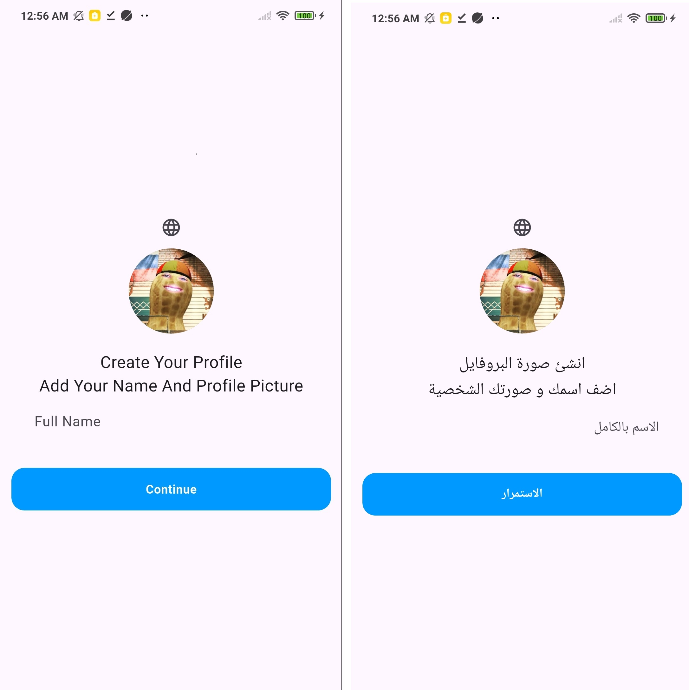
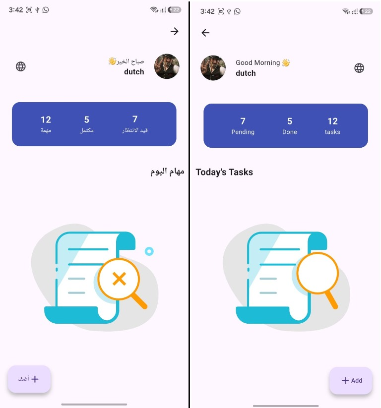
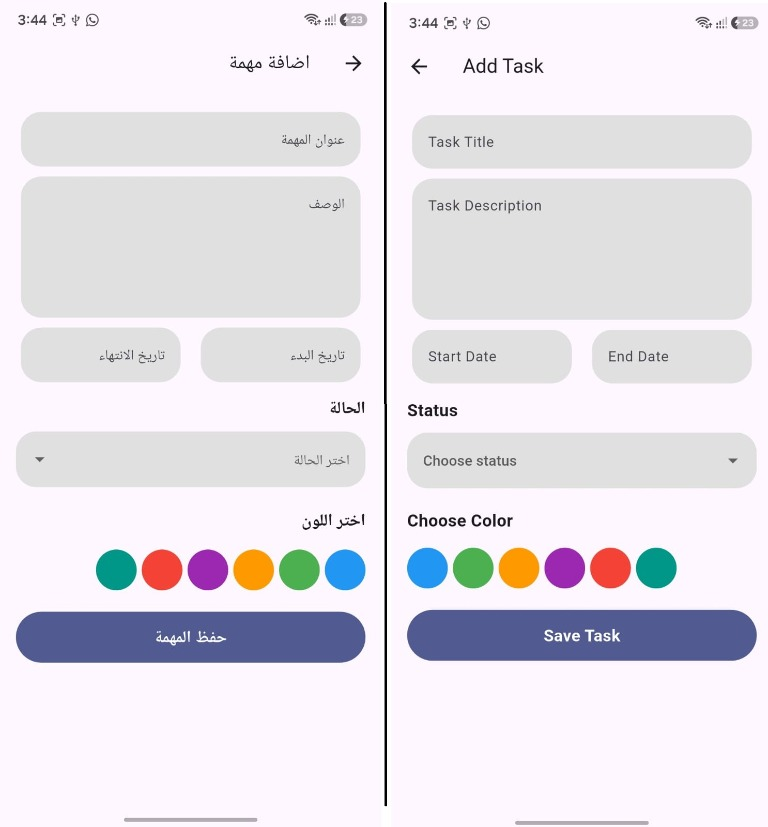

# apptask
```bash
dart run easy_localization:generate --source-dir ./assets/transilations -f keys -o locale_keys.g.dart -O lib/gen
````
A new Flutter project.

## Screenshots




## Empty Tasks



## Add Task




